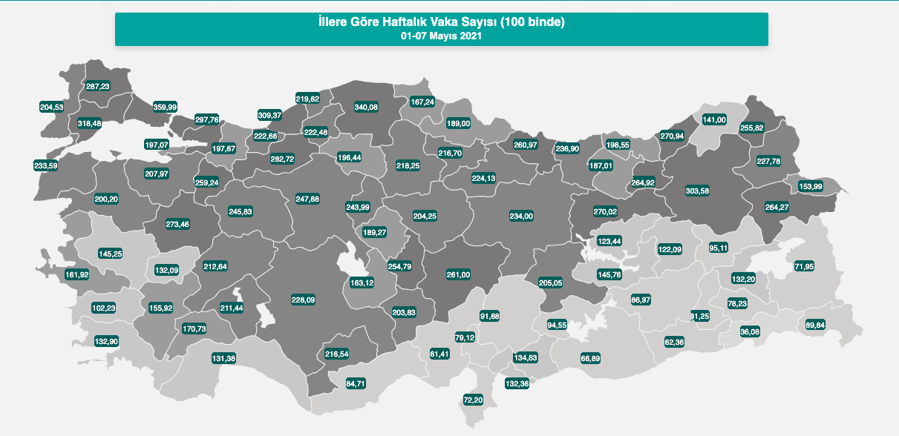
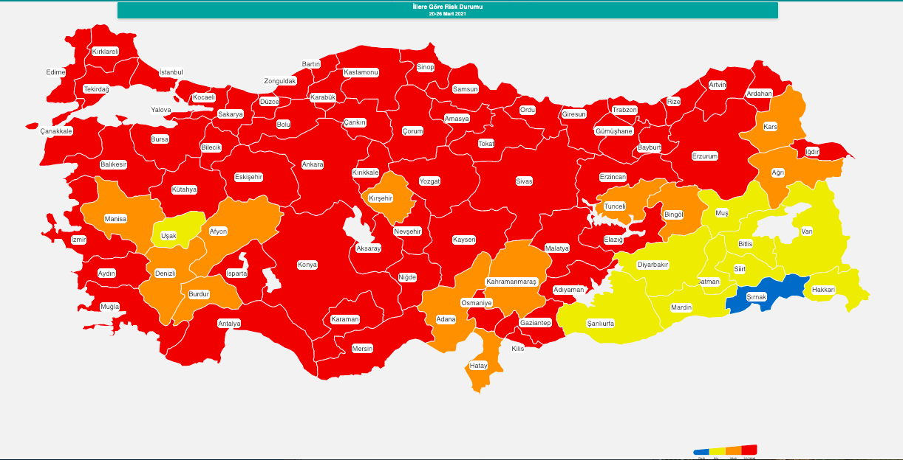

Visit the website https://covid19.saglik.gov.tr/ which gives official statistics on Covid-19 in
our country. The front web page involves two maps titled "İllere göre haftalık vaka sayısı (100 binde)", and "İllere göre risk durumu", which are given below, respectively.


```{r, echo=F, fig.align='center', out.width="60%", fig.cap = "İllere göre haftalık vaka sayısı (100 binde)"}

```


```{r, echo=F, fig.align='center', out.width="60%", fig.cap ="İllere göre risk durumu"}

```

1. Scrape the data on "weekly confirmed cases" table available at https://covid19.saglik.gov.tr/  
via `R package rvest`.
2. Use this data to reproduce the similar of these **two maps** via `R package leaflet`.  
   2.1. You can use the `shape files` which we have used in lectures.  
   2.2. In map1 there seems four different colors depending on the confirmed case count value: 1) 0-150, 2) 151-200, 3) 201-250, and 4) 251+.  
   2.3. In map 1, you do not need to fill in the title rectangular box, text boxes in each province, and pop-window backgrounds with green color.  
   2.4. You do not have to put the plot titles. It requires some HTML skills.  
   2.5. When merging data files according to provinces, be careful. Double-check the names of provinces. If you are doing something wrong you can understand it by checking the locations of the provinces on map.  
   2.6. Save the maps as `.html` files by `htmlwidgets::saveWidget`.   
3. Feel free to improve the readability of the maps.
4. Since the websites are being upgraded regularly, it is not of importance which data you have used in your homework as long as it belongs a recent one.


**Cautionary notes**: 
1) Homework assignments are individual-based studies. For that reason, students are expected to do homework assignments by themselves (**I will also check your commit history to see the evolution of the homework over time**). Homework assignments will not be accepted after deadline. There is **NO** make-up for missed homework.
2) You should download `R Project` on `GitHub` to your local computer, do the changes as needed, delete all the files that you have not used to produce your homework, and finally commit and push all the required files (including `.Rmd` files, no `.pdf` submission since these are dynamic maps) by
 **June 7, 2021 18:00** via [GitHub Classroom of MAT381E organization](https://github.com/MAT381E).
